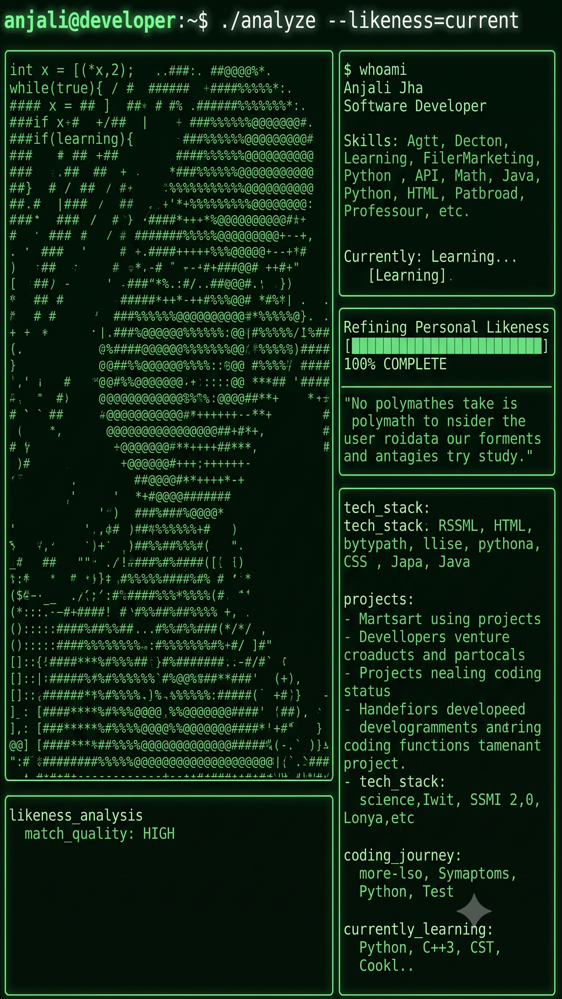

<!-- 1. ANIMATED TERMINAL HEADER -->

  

<!-- 2. MATRIX PIC + DYNAMIC TYPING & SYSTEM STATUS -->
<table border="0" style="border: none; width: 100%;">
<tr style="border: none;">
<td width="42%" align="center" style="border: none; vertical-align: middle;">

</td>
<td width="58%" align="left" style="border: none; vertical-align: middle; padding-left: 20px;">
<h3><code>&gt; SYSTEM_STATUS: OPERATIONAL</code></h3>

<i>"Becoming a polymath is not about knowing everything. It is about staying curious enough to learn anything."</i>

<!-- Animated typing text -->

  

<!-- Live Connect Badges -->

</td>
</tr>
</table>

---

### ⚙️ `$ ./tech_stack --view=detailed`

| Domain | Stack & Technologies |
| :--- | :--- |
| **Languages** | `Java 21` `Python` `C++` `SQL` |
| **Backend & Architecture** | `Spring Boot` `REST APIs` `Microservices` `Idempotency Design` |
| **Security & Cryptography**| `AES-256` `RSA Handshake` `TTL Eviction` `Bluetooth Protocols` |
| **Databases** | `MySQL` `PostgreSQL` `Redis` |

---

### 🚀 `$ ./projects --active`

#### 01. SECURE TRANSACTION ENGINE
* **Architecture:** Spring Boot | Java 21
* **Cryptography:** AES-256 Payload Encryption + RSA Handshake
* **Reliability:** Idempotent Request Deduplication & Replay-Attack Prevention (TTL)
* **Protocols:** BLE Protocol Bridging

#### 02. HIGH-CONCURRENCY BACKEND SERVICE
* **Stack:** Java 21 | Spring Data JPA | MySQL
* **Architecture:** Strict REST Constraints & Centralized Error Contracts

---

#### 📊 Current Focus & Metrics
* 🟢 **Core Concurrency & JVM Internals** — Completed (100%)
* 🟢 **Resilient API Design & Cryptography** — Completed (100%)
* ⚡ **Large-Scale Distributed Architecture & Applied AI** — In Progress
